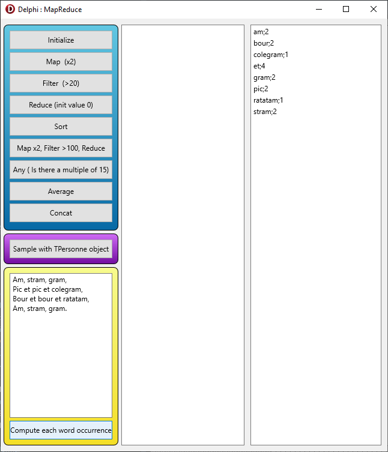

# MapReduce 
 MapReduce with Delphi

GBEArray is an implementation of MapReduce. It's a generic TArray<T> with some methods : map, reduce, filter, gather, any, print and concat.

The project is a sample application to explain how to use it.

In the blue rectangle, you need to click on Initialize button to generate a random dataset of 20 integers. The other buttons in the blue rectangle use this dataset.  
In the purple rectangle, the click on the button show a sequence of treatments on complex object (TPersonne).  
Finally, in the yellow rectangle, there is a TMemo where you can write some text. If you click on the button, the process will extract each word and compute for each word its number of occurrences.
 
 
